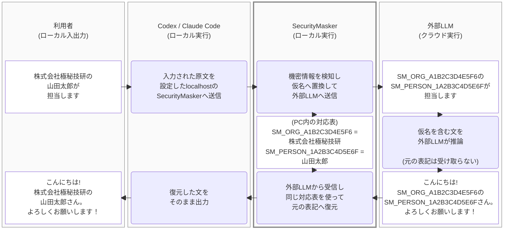

# SecurityMasker

SecurityMaskerは、CodexやClaude CodeなどのコーディングAIエージェントが外部LLMへ送る
プロンプトから、機密情報を自分のPC内でマスクするGatewayです。検出した会社名、人名、project名
などを会話ごとの仮名へ置き換え、回答が戻るとPC内で元の表記へ復元します。

検査を完了できない場合は、保護能力を下げて送信を続けず、その通信を止めます。ChatGPTや
Claude Codeの認証情報は保存しません。



利用者が入力した原文はPC内でマスクされ、外部LLMは仮名を含むプロンプトを受け取ります。外部LLMが
回答で仮名をそのまま使った場合、SecurityMaskerがPC内で元の表記へ戻してクライアントへ返します。

## 何を外部へ送り、何をPC内に残すか

| PC内に残す | 外部LLMへ送る |
|---|---|
| 元の機密情報 | マスク済みの仮名 |
| 仮名と原文の対応表 | 通常のプロンプト構造 |
| 暗号化SQLiteとmaster key | clientが選んだmodel ID |
| ユーザー辞書 | 対応providerの認証header |

送信直前にrequest全体を再検査し、元の値が残っている場合や検査を完了できない場合は通信を
blockします。未知の組織内用語を自動で100%推測することはできないため、重要語はユーザー辞書へ
登録します。

詳しい流れは[SecurityMaskerの仕組み](docs/concepts/how-it-works.md)、利用前の確認事項は
[安全な使い方](docs/security/safe-use.md)を参照してください。

## 利用できる環境

現在はsource版を利用します。

| 環境 | 状態 |
|---|---|
| macOS arm64、Python 3.11／3.12 | 検証済み |
| Linux arm64、Python 3.12 | 検証済み |
| Windows 11 x64 build 26100以降、Python 3.12 x64 | source版を検証済み |
| one-file Lite／Full binary | macOS／Linux arm64で技術検証済み。[私的build手順](docs/development/binary-build.md)のみ。未公開 |

Windowsは[Windows native source版の導入手順](docs/guides/windows-native-source.md)に従います。
Windows one-file版と表にない環境は未対応です。platformとclientの詳細は
[対応環境](docs/reference/compatibility.md)にあります。

## 合成データで試す

初回setupでは固定済みPython packageと日本語NER modelを取得するため、ネットワーク接続と数GBの
空き容量が必要です。通常利用中にmodelをdownloadすることはありません。

```console
./scripts/setup
. .venv/bin/activate
python3 securitymasker.py init --mode chatgpt --port 4000
python3 securitymasker.py preview \
  "株式会社極秘技研の山田太郎が担当します"
python3 securitymasker.py gateway
```

この例は合成データだけを使います。実データを入力する前に、client接続、辞書の調整、期待する
結果、元へ戻す方法を[導入ガイド](docs/getting-started.md)で確認してください。

Claude Codeを使う場合は`--mode claude --port 4001`で初期化します。1 processは1 modeだけを扱い、
両方を使う場合は別config、別DB、別key、別portで起動します。

## 保護範囲の要点

- ユーザー辞書が、会社名、顧客名、project名などの組織固有語を最優先で検出します。
- 決定論的detectorが、API key、秘密鍵、メール、電話、公的識別子などを検出します。
- 固定済み日本語NERが、未登録の一般的な人名、組織名、地名を補完します。
- JSON、code、shell command、patch、tool callの構造を保つ仮名を使います。
- CodexのResponsesはHTTP/SSEとWebSocketの双方で同じmask・復元境界を通します。
- sessionとmodeをまたいで仮名や対応表を共有しません。
- file、image、audioのprotocol-native添付は、内容を完全検査できないためblockします。
- Web版ChatGPT、remote session、外部MCPなど、localhost Gatewayを通らない通信は保護しません。

## 次に読む

- 初めて使う: [導入ガイド](docs/getting-started.md)
- 組織固有語を登録する: [辞書のカスタマイズ](docs/guides/customize-dictionary.md)
- 毎日の起動、backup、更新、復旧: [運用ガイド](docs/README.md#運用する)
- commandと設定を調べる: [Reference](docs/README.md#仕様を調べる)
- 安全性と設計を確認する: [Security文書](docs/README.md#安全性を確認する)
- sourceを読む・開発する: [開発文書](docs/README.md#開発する)

文書全体は[文書案内](docs/README.md)から目的別に辿れます。

## License

SecurityMasker自身のsource codeと文書は[MIT License](LICENSE)で提供します。setupが取得する
Python packageと日本語NER modelは、それぞれのlicenseに従います。出典とsource／binary配布の
違いは[Third-party notices](THIRD_PARTY_NOTICES.md)と
[model licenses](docs/reference/model-licenses.md)を参照してください。
